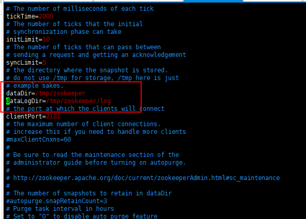
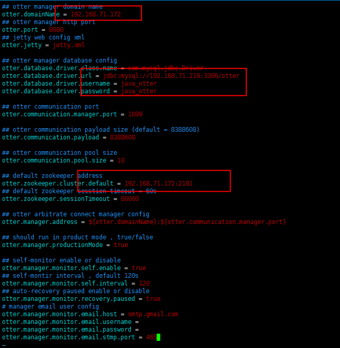
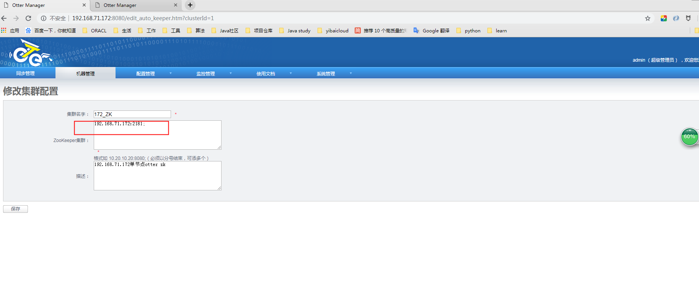
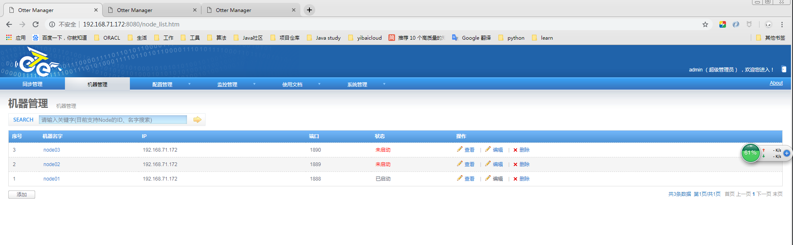

# otter 安装教程

### wget安装
  `
  yum -y install wget
  `

### 安装JDK
- 浏览器下载jdk

  ```
  // 下载 jdk-8u221-linux-x64.rpm
  chmod +x jdk-8u221-linux-x64.rpm
  rpm -ivh jdk-8u221-linux-x64.rpm
  //查看java的版本信息
  java -version

  vim /etc/profile

  // 添加以下配置
  export JAVA_HOME=/usr/java/jdk1.8.0_221-amd64

  export JAVA_BIN=/usr/java/jdk1.8.0_221-amd64/bin

  export PATH=$PATH:$JAVA_HOME/bin

  export CLASSPATH=:$JAVA_HOME/lib/dt.jar:$JAVA_HOME/lib/tools.jar

  export JAVA_HOME JAVA_BIN PATH CLASSPATH

  // 执行
  source /etc/profile
  ```

#### zookeeper

  `
  https://archive.apache.org/dist/zookeeper/zookeeper-3.4.9/zookeeper-3.4.9.tar.gz
  `

  ```

  tar -zxvf zookeeper-3.4.9.tar.gz

  mv zookeeper-3.4.9 /usr/local/zookeeper

  cd /usr/local/zookeeper/conf/

  cp zoo_sample.cfg zoo.cfg

  yum install vim

  vim zoo.cfg

  ```

- 修改zoo.cfg如图



<!--  -->
- 创建/tmp/zookeeper/log 日志目录防止启动找不到目录报错

  ```
  mkdir /tmp/zookeeper/
  mkdir /tmp/zookeeper/log
  ```

- 配置环境变量
`
vim /etc/profile
`
- 添加配置如下

  ```
  export ZOOKEEPER=/usr/local/zookeeper
  export PATH=$PATH:$ZOOKEEPER/bin
  ```
- 执行
  ```
  source /etc/profile    //使生效
  ```

- 启动Zookeeper
  ```
  zkServer.sh start //启动
  zkServer.sh status  //查看运行状态
  ```

### manager

- 初始化sql

  https://raw.githubusercontent.com/alibaba/otter/master/manager/deployer/src/main/resources/sql/otter-manager-schema.sql


- 下载manager
```
wget https://github.com/alibaba/otter/releases/download/otter-4.2.17/manager.deployer-4.2.17.tar.gz
mkdir /usr/local/otter/
mkdir /usr/local/otter/manager
tar -zxvf manager.deployer-4.2.17.tar.gz  -C /usr/local/otter/manager/
```

- 修改配置文件运行

  ```
  cd /usr/local/otter/manager/conf
  vim otter.properties
  ```



```
  cd /usr/local/otter/manager/bin/
  ./startup.sh
  ```

-  开放端口
  ```
  firewall-cmd --permanent --add-port=8080/tcp

  firewall-cmd --reload
  ```

http://192.168.71.172:8080
初始密码为：admin/admin

- 在页面配置zk



- 在页面配置node01


- 未启动node01


- 下载node

  ```
  wget https://github.com/alibaba/otter/releases/download/otter-4.2.17/node.deployer-4.2.17.tar.gz
  mkdir /usr/local/otter/node
  tar -zxvf node.deployer-4.2.17.tar.gz  -C /usr/local/otter/node/

  cd /usr/local/otter/node/conf
  vim otter.properties
  # 配置manager地址，可以是多个
  otter.manager.address = 192.168.71.172:1099
  ```

- 选取node节点序号

  `
  echo 1 > nid
  `
- 启动节点
```
cd /usr/local/otter/node/bin/
./startup.sh
```


***至此单节点已经安装完成***

_考虑节点可能面临挂掉风险，此处配置多节点进行负载，保证高可用_
### 安装aria2

  ```
  wget https://nchc.dl.sourceforge.net/project/aria2/stable/aria2-1.19.0/aria2-1.19.0.tar.gz

  mkdir /usr/local/otter/aria2

  tar -zxvf aria2-1.19.0.tar.gz -C /usr/local/otter/aria2/
  cd /usr/local/otter/aria2/
  mv aria2-1.19.0/ ../aria2C
  rm -rf /usr/local/otter/aria2/
  cd /usr/local/otter/aria2C
  ```

- 安装gcc 5.2
  ```
  yum install centos-release-scl -y
  yum install devtoolset-4-toolchain -y
  scl enable devtoolset-4 bash
  gcc --version

  ./configure

  make  // 报错的话，再重新执行一次/configure这个就好了。

  make install
  ```
#### 配置环境
  ```
  vim /root/.bash_profile
  # 添加aria2 安装路径到path    /usr/local/otter/aria2C/src
  PATH=$PATH:$HOME/bin:/usr/local/otter/aria2C/src
  ```
### 配置多node节点

- 配置页面node02 node03 图片


  ```
  mkdir /usr/local/otter/node02
  mkdir /usr/local/otter/node03
  cd /opt/

  tar -zxvf node.deployer-4.2.17.tar.gz -C /usr/local/otter/node02/
  tar -zxvf node.deployer-4.2.17.tar.gz -C /usr/local/otter/node03/
  cd /usr/local/otter/node02/conf/

  修改配置文件
  vim otter.properties
  // manager地址
  otter.manager.address = 192.168.71.172:1099

  echo 2 > nid

  cd ../bin
  ./startup.sh

  cd /usr/local/otter/node03/conf/
  修改配置文件
  vim otter.properties
  // manager地址
  otter.manager.address = 192.168.71.172:1099

  echo 3 > nid
  cd ../bin
  ./startup.sh
```
